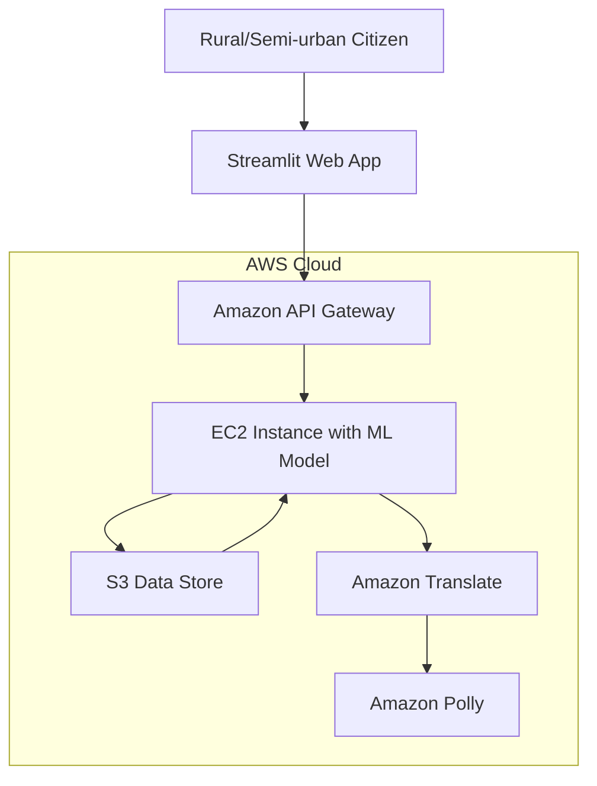

# Design Document: Scheme Sathi

## Overview

Scheme Sathi is a cloud-native AI-powered assistant that helps rural and semi-urban citizens discover government schemes they are eligible for. The system follows a microservices architecture deployed on AWS, with a Streamlit web interface, Random Forest ML model for predictions, and integrated translation and text-to-speech services.

The architecture prioritizes simplicity for end users while maintaining scalability and reliability through AWS managed services. The system processes user demographic data through a trained ML model and returns personalized scheme recommendations in the user's preferred language with optional audio output.

## Architecture

### High-Level Architecture



### Component Architecture

The system consists of six main components:

1. **Web Interface Layer**: Streamlit application providing user interaction
2. **API Gateway Layer**: Request routing, authentication, and rate limiting
3. **ML Prediction Service**: Random Forest model hosted on EC2
4. **Data Storage Layer**: S3 buckets for model artifacts and scheme data
5. **Translation Service**: Amazon Translate for multi-language support
6. **Audio Service**: Amazon Polly for text-to-speech conversion

### Data Flow

1. User enters demographic data through Streamlit interface
2. Web app sends prediction request to API Gateway
3. API Gateway routes request to EC2 ML service
4. ML service loads model from S3 and makes predictions
5. Results are returned to API Gateway
6. If translation requested, results pass through Amazon Translate
7. If audio requested, translated text passes through Amazon Polly
8. Final results (text/audio) returned to user via Streamlit interface

## Components and Interfaces

### Web Interface Component

**Technology**: Streamlit deployed on EC2 instance
**Responsibilities**:
- Collect user demographic input (age, income, gender, occupation)
- Validate input data client-side
- Display scheme recommendations
- Handle language selection and audio playback
- Provide user-friendly error messages

**Key Interfaces**:
- `UserInputForm`: Collects and validates demographic data
- `ResultsDisplay`: Shows scheme recommendations with formatting
- `LanguageSelector`: Manages user language preferences
- `AudioPlayer`: Controls text-to-speech playback

### API Gateway Component

**Technology**: Amazon API Gateway (REST API)
**Responsibilities**:
- Route requests between web interface and backend services
- Implement authentication and authorization
- Apply rate limiting and throttling
- Handle CORS for web application
- Provide standardized error responses

**Key Endpoints**:
- `POST /predict`: Submit demographic data for scheme prediction
- `POST /translate`: Translate scheme results to target language
- `POST /synthesize`: Convert text to speech audio
- `GET /health`: Health check endpoint

### ML Prediction Service

**Technology**: Python Flask/FastAPI service on EC2
**Responsibilities**:
- Load and serve Random Forest model
- Process demographic input data
- Generate scheme eligibility predictions
- Return ranked results with confidence scores
- Handle model versioning and updates

**Key Interfaces**:
- `ModelLoader`: Loads trained model from S3
- `DataPreprocessor`: Cleans and transforms input data
- `PredictionEngine`: Generates scheme eligibility scores
- `ResultsFormatter`: Structures prediction output

### Data Storage Component

**Technology**: Amazon S3
**Responsibilities**:
- Store trained Random Forest model artifacts
- Maintain scheme eligibility criteria database
- Version control for model updates
- Backup and disaster recovery

**Data Structure**:
- `/models/`: Trained ML model files (pickle/joblib format)
- `/schemes/`: Government scheme metadata and eligibility rules
- `/backups/`: Historical versions and backups

### Translation Service Integration

**Technology**: Amazon Translate
**Responsibilities**:
- Translate scheme descriptions and recommendations
- Support major Indian regional languages
- Handle translation errors gracefully
- Cache common translations for performance

**Supported Languages** (based on research):
- Hindi (with bilingual support)
- English (Indian)
- Bengali, Tamil, Telugu, Marathi, Gujarati (as available)

### Audio Service Integration

**Technology**: Amazon Polly
**Responsibilities**:
- Convert translated text to natural speech
- Support Indian language voices (Aditi for Hindi/English)
- Generate audio files for playback
- Handle audio generation failures

## Data Models

### User Profile Model
```python
class UserProfile:
    age: int  # 18-100
    income: float  # Annual income in INR
    gender: str  # "Male", "Female", "Other"
    occupation: str  # Predefined occupation categories
    location_state: str  # Indian state code
    language_preference: str  # ISO language code
```

### Scheme Prediction Model
```python
class SchemePrediction:
    scheme_id: str
    scheme_name: str
    description: str
    eligibility_score: float  # 0.0-1.0 confidence
    estimated_benefit: float  # INR amount
    application_process: str
    required_documents: List[str]
```

### API Request/Response Models
```python
class PredictionRequest:
    user_profile: UserProfile
    language: str
    include_audio: bool

class PredictionResponse:
    predictions: List[SchemePrediction]
    translated_content: Optional[str]
    audio_url: Optional[str]
    processing_time: float
```

### ML Model Features
The Random Forest model uses the following feature set:
- Age (normalized)
- Income bracket (categorical)
- Gender (one-hot encoded)
- Occupation category (categorical)
- State/region (categorical)
- Family size (derived/optional)

## Correctness Properties

*A property is a characteristic or behavior that should hold true across all valid executions of a system—essentially, a formal statement about what the system should do. Properties serve as the bridge between human-readable specifications and machine-verifiable correctness guarantees.*

Before defining the correctness properties, I need to analyze the acceptance criteria from the requirements to determine which are testable as properties.

### Property 1: Input Validation and Processing
*For any* user demographic input (age, income, gender, occupation), the system should accept valid data and create proper User_Profile objects, while rejecting invalid data with clear error messages
**Validates: Requirements 1.2, 1.3, 1.4**

### Property 2: ML Model Prediction Consistency
*For any* valid User_Profile, the Scheme_Predictor should process the data using the Random Forest model and return a ranked list of schemes with confidence scores
**Validates: Requirements 2.1, 2.3**

### Property 3: Data Access Reliability
*For any* prediction request, the Scheme_Predictor should access current scheme data from the Data_Store before making predictions
**Validates: Requirements 2.2, 6.2**

### Property 4: API Request Flow
*For any* valid prediction request from the Web_Interface, the API_Gateway should route it to the Compute_Instance and forward the response back
**Validates: Requirements 3.1, 3.3**

### Property 5: API Validation and Security
*For any* incoming request, the API_Gateway should validate request format, implement authentication, and apply rate limiting
**Validates: Requirements 3.2, 3.4**

### Property 6: Error Response Standardization
*For any* error condition in the API_Gateway, standardized error responses should be returned
**Validates: Requirements 3.5**

### Property 7: Language Preference Management
*For any* user language selection, the Web_Interface should store the preference and use it for subsequent operations
**Validates: Requirements 4.1**

### Property 8: Translation Workflow
*For any* scheme results and user language preference, the Translation_Service should translate content and display it in the selected language
**Validates: Requirements 4.2, 4.3**

### Property 9: Audio Generation Workflow
*For any* translated text and audio request, the Audio_Service should convert text to speech with appropriate voice settings and provide playback controls
**Validates: Requirements 5.1, 5.2, 5.3**

### Property 10: Data Versioning
*For any* scheme data update, the Data_Store should maintain version control and create backup copies
**Validates: Requirements 6.3**

### Property 11: Graceful Degradation
*For any* system component failure, the SchemeSathi should degrade functionality gracefully rather than failing completely
**Validates: Requirements 7.5**

### Property 12: Data Encryption in Transit
*For any* user demographic data submission, the SchemeSathi should encrypt all personal information during transmission
**Validates: Requirements 8.1**

### Property 13: Privacy Protection
*For any* request processing, the SchemeSathi should not log or store personally identifiable information unnecessarily
**Validates: Requirements 8.3**

## Error Handling

### Input Validation Errors
- **Invalid Age**: Ages outside 18-100 range rejected with user-friendly message
- **Invalid Income**: Non-numeric or negative income values rejected
- **Missing Fields**: Incomplete demographic data prompts for required fields
- **Invalid Occupation**: Occupation not in predefined categories shows selection list

### ML Model Errors
- **Model Unavailable**: Graceful fallback with cached results or maintenance message
- **Prediction Failure**: Error logging with generic user message about temporary issues
- **Data Access Failure**: Fallback to cached scheme data with staleness warning
- **Invalid Feature Values**: Input sanitization and default value substitution

### Translation Service Errors
- **Translation Failure**: Fallback to English with notification about translation unavailability
- **Unsupported Language**: Default to English with list of supported languages
- **Service Timeout**: Retry mechanism with exponential backoff

### Audio Service Errors
- **Audio Generation Failure**: Text-only fallback with audio unavailable message
- **Unsupported Voice**: Default voice selection with notification
- **Playback Issues**: Alternative audio formats and download options

### Infrastructure Errors
- **API Gateway Timeout**: Retry mechanism with user feedback
- **EC2 Instance Failure**: Load balancer failover to backup instances
- **S3 Access Issues**: Local caching with data staleness warnings
- **Network Connectivity**: Offline mode with cached data where possible

## Testing Strategy

### Dual Testing Approach

The testing strategy employs both unit testing and property-based testing to ensure comprehensive coverage:

**Unit Tests**: Focus on specific examples, edge cases, and integration points
- Test specific demographic input combinations
- Verify error message content and formatting
- Test API endpoint responses with known inputs
- Validate translation for specific language pairs
- Test audio generation for specific text samples

**Property-Based Tests**: Verify universal properties across all inputs
- Generate random demographic data to test input validation
- Test ML model predictions with varied user profiles
- Verify API routing behavior with random request patterns
- Test translation consistency across language combinations
- Validate audio generation across different text inputs

### Property-Based Testing Configuration

**Testing Framework**: Hypothesis (Python) for property-based testing
**Test Configuration**: Minimum 100 iterations per property test
**Test Tagging**: Each property test references its design document property

Example test tags:
- **Feature: schemesathi, Property 1: Input Validation and Processing**
- **Feature: schemesathi, Property 2: ML Model Prediction Consistency**
- **Feature: schemesathi, Property 8: Translation Workflow**

### ML Model Testing Strategy

**Model Validation**:
- Cross-validation on training data to verify model accuracy
- A/B testing with baseline rule-based system
- Bias testing across demographic groups
- Performance testing with various data distributions

**Prediction Testing**:
- Property tests for prediction consistency (same input → same output)
- Boundary testing for edge cases in demographic data
- Load testing for concurrent prediction requests
- Accuracy testing against known scheme eligibility rules

### Integration Testing

**End-to-End Workflows**:
- Complete user journey from input to audio output
- Multi-language workflow testing
- Error recovery and fallback testing
- Performance testing under various load conditions

**Service Integration**:
- API Gateway to EC2 communication
- S3 data access patterns
- Amazon Translate and Polly service integration
- Authentication and authorization flows